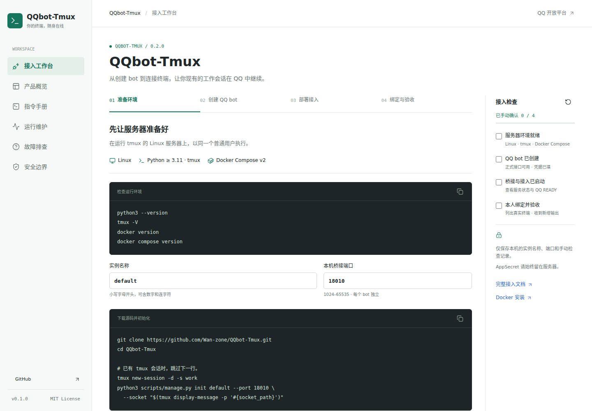

# QQbot-Tmux

[](https://github.com/Wan-zone/QQbot-Tmux/actions/workflows/tests.yml)
[](https://github.com/Wan-zone/QQbot-Tmux/actions/workflows/site.yml)
[MIT License](LICENSE) · Linux · QQ 官方接口 · 不需要模型 API Key

**把服务器里正在运行的终端，接进 QQ。**

不另起一个 AI 会话，不让模型代按键。选择现有 tmux 窗格后，QQ 消息直接输入终端；终端里的 Codex、shell 或其他程序继续在原来的会话中运行。项目本身不调用大模型，也不需要模型 API Key。

一个 QQ bot，同时管理本地和远程服务器上的多个终端。每个窗格拥有固定的001–999编号，输入指向编号，输出带终端名，不需要来回切换机器人。

[从零接入](docs/getting-started.md) · [使用手册](docs/usage.md) · [故障排查](docs/troubleshooting.md) · [运行维护](docs/operations.md) · [安全说明](SECURITY.md)

## 从这里开始

| 你想做什么 | 阅读入口 |
| --- | --- |
| 第一次用：注册 QQ bot、配置凭据、部署并绑定 | [从零接入](docs/getting-started.md) |
| 已经部署：选终端、输入消息、操作菜单、查看输出 | [使用手册](docs/usage.md) · [指令速查](#指令速查) |
| 一个bot连接多个本地/远程终端 | [多终端使用](docs/usage.md) · [SSH服务器配置](docs/remote.md) |
| 不回复、没有新增输出、输入状态不明 | [故障排查](docs/troubleshooting.md) |
| 升级、备份、回滚，或了解操作权限 | [运行维护](docs/operations.md) · [安全说明](SECURITY.md) |

本文和 `docs/` 就是完整的产品介绍与使用入口，直接在 GitHub 阅读即可，无需另开网站。

## 一次完整交互

```text
你：/tmux ls
Bot：列出当前 tmux 窗格及占用情况

你：/tmux sel 001 ent
Bot：一次返回最近约 100 行上下文

你：/tmux sel 001 检查刚才的修改，并运行测试
Bot：后续新增的完整说明和回答，按段落自动追加

你：/tmux sel 001 /model
Bot：完整显示模型选择菜单
你：/tmux sel 001 key down
你：/tmux sel 001 key enter

你：/tmux sel 001 list100
Bot：完整终端快照，包括默认隐藏的工具操作日志

你：/tmux sel 001 ext
Bot：退出转发，服务器上的任务仍然运行
```

群里每条指令都要 **@对应机器人**。同一个bot可同时连接多个窗格，各自独立追加、重试和断开。所有回显带 `[001 · local · work:0.0]` 或远程服务器标签。多个bot仍不能同时占用同一窗格。

## 核心能力

- **固定编号直连**：001–999持久化对应真实窗格，改名和重排不会误投；窗格关闭后编号失效，不复用到新任务。
- **多服务器**：SSH密钥接入远端tmux，`ls`统一列出本地和远端；无需远端常驻服务，不放宽主机指纹校验。
- **持续追加**：进入时任务已在运行也能继续接收；不必再发一句话才开始监听。
- **正文与快照分开**：自动转发自然语言和代码示例，隐藏 Ran、Explored、Edited、网页操作和 diff 噪音；真实429/5xx错误保留。
- **完整文本体**：不把回答拆成一行一条；合并终端宽度造成的软换行，保留段落、代码、表格与列表结构。超长内容以完整文本附件发送。
- **菜单原样回显**：模型、权限、确认等已识别的菜单整体返回，不把光标变动当成几行增量。
- **输入去重与断点恢复**：HTTP超时先查输入收据；保存投递进度，重启后补发尚未确认的内容。
- **双方静默才断开**：你和bot连续30分钟都没有新消息才释放连接；bot还在发送新内容就继续保持。断开不停止终端任务。
- **实例隔离与互斥**：每个AppID独立凭据、所有者、群身份和投递数据；共享内核锁防止不同bot抢同一窗格。
- **紧凑的 QQ 界面**：不用消息下方键盘；输入框面板仅注册 `/help`、`/tmux ls`，完整帮助用 `/tmux help`。

## 快速部署

支持 **Linux + Python 3.11及以上 + tmux + Docker Compose v2**。QQ接入使用固定版本的Hermes QQ适配器依赖镜像；只启动本项目的终端入口，**不启动Hermes Agent、Gateway、日记或定时任务**。宿主桥接仅使用Python标准库。

先在 [QQ机器人开放平台](https://q.qq.com/) 创建机器人，取得AppID和AppSecret，并按平台要求配置测试成员、私聊或群聊使用范围。服务器无法绕过QQ平台的审核、可用范围和主动消息权限。

### 1. 初始化实例

在仓库根目录，以运行tmux的**普通用户**执行：

```bash
git clone https://github.com/Wan-zone/QQbot-Tmux.git
cd QQbot-Tmux

# 已有会话时不必创建；这里仅演示一个新工作会话。
tmux new-session -d -s work

python3 scripts/manage.py init default \
  --port 18010 \
  --socket "$(tmux display-message -p '#{socket_path}')"
```

实例生成在 `instances/default/`。编辑其中的 `bot.env`，填写：

```dotenv
QQ_APP_ID=你的AppID
QQ_CLIENT_SECRET=你的AppSecret
```

真实配置、绑定信息和令牌均不属于源码，已由Git和Docker构建上下文忽略。初始化遇到已存在实例会拒绝覆盖，避免丢失绑定和投递进度。

### 2. 启动本机桥接

```bash
systemctl --user enable --now \
  "$PWD/instances/default/qq-tmux-bridge-default.service"
systemctl --user status qq-tmux-bridge-default.service
```

需要退出SSH后继续常驻时，由管理员为该普通用户启用linger：

```bash
sudo loginctl enable-linger "$USER"
```

没有用户systemd的环境，可使用进程管理器运行同一桥接入口；参数见生成的service文件。HTTP只监听本机环回地址，不要将18010暴露到公网。

### 3. 启动 QQ bot

```bash
docker compose --env-file instances/default/compose.env \
  -p qq-tmux-default up -d --build

python3 scripts/manage.py pairing default
```

最后一条在本地显示一次性 `/bind ...` 口令。**在本人的QQ私聊中发给机器人**，绑定成功后口令销毁。此后直接发送 `/tmux ls`。

本地有多个账号时，Docker权限、systemd用户和tmux拥有者必须对应。不要用 `sudo python3 scripts/manage.py init`，也不要为了方便把桥接改成root。

### 4. 绑定群聊或增加实例

先私聊已绑定bot发送 `/group bind`，再将返回的一次性指令 @该bot 发到目标群。群绑定票据10分钟有效；只有绑定的本人群成员身份可以操作，但输出对全群可见。

新增bot重复初始化，例如：

```bash
python3 scripts/manage.py init second --port 18011 \
  --socket "$(tmux display-message -p '#{socket_path}')"
# 填写 instances/second/bot.env，使用另一套AppID和AppSecret。
systemctl --user enable --now \
  "$PWD/instances/second/qq-tmux-bridge-second.service"
docker compose --env-file instances/second/compose.env \
  -p qq-tmux-second up -d --build
python3 scripts/manage.py pairing second
```

每个实例必须使用独立端口、Compose项目名和QQ凭据。由同一仓库初始化的实例共用 `instances/pane-locks/`，自动启用窗格互斥；不同仓库目录部署时须为桥接显式指定同一个锁目录和同一个tmux socket。

### 5. 可选：连接远程服务器

在`instances/default/data/tmux-relay/hosts.json`配置服务器IP/主机名、端口、用户、私钥路径和已核验的known_hosts，重启宿主桥接。`/tmux ls`会同时列出`local`及远程服务器，使用同一套三位编号指令。[完整SSH接入说明](docs/remote.md)

## 指令速查

| 指令 | 作用 |
| --- | --- |
| `/help`、`/tmux help` | 完整终端帮助 |
| `/tmux ls` | 列出窗格及占用者 |
| `/tmux sel 001 ent` | 接入或重连这一窗格，返回100行 |
| `/tmux sel 001 文字` | 原样输入并回车 |
| `/tmux sel 001 /model` | 输入终端程序命令 |
| `/tmux sel 001 type 文字` | 只输入，不回车 |
| `/tmux sel 001 send ent` | 将保留词ent作为文字输入 |
| `/tmux sel 001 key enter` | 发送一个按键 |
| `/tmux sel 001 list100` | 原始100行，只重置这一连接的追加基线 |
| `/tmux sel 001 ext` | 仅退出这一连接，不停止任务 |
| `/group bind`、`/group status`、`/group unbind` | 私聊管理群绑定 |

按键名：`enter`、`esc`、`up`、`down`、`left`、`right`、`tab`、`space`、`backspace`、`delete`、`home`、`end`、`pgup`、`pgdn`、`ctrl-c`、`ctrl-d`。一次发送一个按键。`ent`是接入，不是回车；终端命令也必须加`/tmux sel 编号`前缀。新版不再接受无编号输入或旧版select/exit，避免误投。

公开指令统一使用 `/`。内部桥接保留历史 `#tmux` 协议及键盘数据结构用于兼容测试，但QQ入口拒绝执行旧 `#` 指令，运行时不显示这些键盘。

## 目录与运行原理

```text
QQ消息 → 本人/群身份校验 → 终端命令路由 → 本机认证HTTP → tmux
QQ回显 ← 持久化投递队列 ← 段落/菜单/噪音识别 ← 屏幕采样
```

| 目录 | 职责 |
| --- | --- |
| `src/tmux_bot/app.py` | QQ纯终端接入，不进入模型处理流程 |
| `src/tmux_bot/bridge.py` | tmux操作内核、输入收据和窗格锁 |
| `src/tmux_bot/multiplex.py` | 固定编号、独立租约和多窗格HTTP接口 |
| `src/tmux_bot/multi_relay.py` | 每个窗格独立增量、队列、断点和观察任务 |
| `src/tmux_bot/terminal_relay.py` | 正文清洗、段落、菜单等复用算法 |
| `src/tmux_bot/remote.py` | 严格校验的SSH及本地/远端统一tmux后端 |
| `src/tmux_bot/owner.py` | 一次性绑定及应用独立的所有者/群身份 |
| `src/tmux_bot/group_delivery.py` | QQ群被动回复窗口及主动消息退避 |
| `src/tmux_bot/qq_commands.py` | 斜杠映射和本人输入框面板 |
| `src/tmux_bot/terminal_files.py` | 历史上传索引兼容代码；公开bot拒绝入站附件，不启用文件中转 |
| `vendor/` | QQ适配器快照和上游许可证，不含Hermes私人功能 |
| `scripts/` | 实例初始化、绑定口令及发布检查 |
| `tests/` | 可销毁tmux、路由、互斥、段落、错误及QQ投递回归 |
| `site/` | 可选离线接入助手和浏览器回归，不负责网站发布 |
| `docs/` | 注册接入、使用、排障、升级备份与发布 |
| `instances/` | 本地运行数据，初始化时生成，绝不提交 |

QQ容器只挂载自身数据目录。宿主桥接以tmux拥有者运行，不挂载Docker socket，不监听公网，不从QQ请求中接受任意桥接地址。

<details>
<summary>可选：离线接入助手</summary>

下载仓库后，可以用浏览器直接打开 `site/index.html`，生成实例部署命令、搜索指令并手动检查接入进度。不需要安装 Node.js，也不需要运行网页服务器。GitHub 文件预览不会执行 HTML，直接阅读上面的中文文档即可完成部署。

助手不读取 AppSecret、不接入终端、不收集遥测；只在当前浏览器保存非敏感实例名称、端口和手动检查记录。



</details>

## 测试与发布

```bash
python3 scripts/check_release.py
docker build --target test -t qq-tmux-relay-test .
docker run --rm --network none qq-tmux-relay-test
```

测试创建独立tmux socket，不碰现有工作窗格；QQ传输使用可控响应，不会给真实聊天发送测试消息。CI执行相同命令。由Hermes日记插件专属钩子产生的测试没有带入本仓库，终端和投递行为仍保留回归覆盖。

## 必须知道的限制

1. **转发来自屏幕采样，不是Codex原生事件流。** 极快结束、完全相同且未被观察到运行状态的输出可能无法可靠区分；未知TUI也可能不符合菜单识别规则。需要时用 `/tmux sel 编号 list100` 核对。
2. 工具噪音清洗主要针对Codex风格界面，不保证任意终端程序都能正确区分说明与操作日志。完整快照不清洗。
3. QQ每条群入站消息的被动回复次数和窗口有限；耗尽后需主动群消息权限。被拒绝时保留队列、退避重试，不伪造消息ID；重新 @bot 可提供新窗口。
4. 输入框指令面板取决于机器人能力及QQ客户端同步。注册失败不影响手动输入，服务器不能保证每种客户端立即显示。
5. 退出或30分钟静默只断开转发，不暂停、取消或回滚终端任务。`ctrl-c` 则可能真的中断任务。
6. 这是可信本人使用的远程终端入口，不是多租户服务。安全边界详见 [SECURITY.md](SECURITY.md)。

## 许可与致谢

采用 [MIT License](LICENSE)。QQ接入复用 [Hermes Agent](https://github.com/NousResearch/hermes-agent) 的QQ适配器和固定运行依赖，保留 [上游许可证](vendor/HERMES_LICENSE) 与 [NOTICE](NOTICE)。终端会话由tmux提供，QQ平台能力由腾讯QQ机器人官方接口提供。
